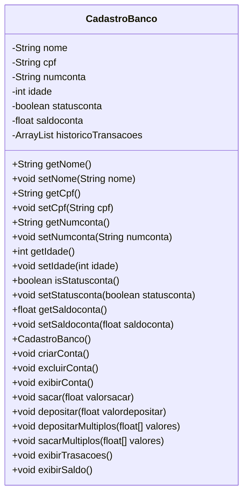
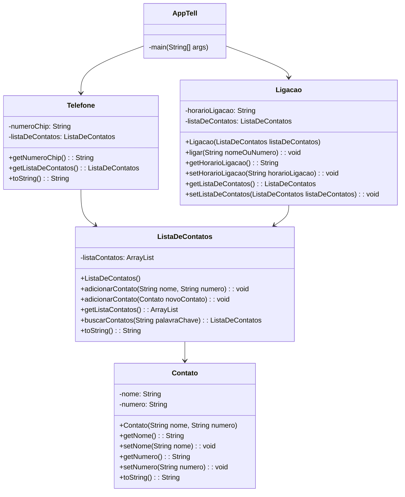

## Melhores projetos simulando o mundo real em POO 

## Diagrama de Classes (Treino Poo, simulando um banco)

```mermaid
classDiagram
  class CadastroBanco {
    -String nome
    -String cpf
    -String numconta
    -int idade
    -boolean statusconta
    -float saldoconta
    -ArrayList<String> historicoTransacoes
    +String getNome()
    +void setNome(String nome)
    +String getCpf()
    +void setCpf(String cpf)
    +String getNumconta()
    +void setNumconta(String numconta)
    +int getIdade()
    +void setIdade(int idade)
    +boolean isStatusconta()
    +void setStatusconta(boolean statusconta)
    +float getSaldoconta()
    +void setSaldoconta(float saldoconta)
    +CadastroBanco()
    +void criarConta()
    +void excluirConta()
    +void exibirConta()
    +void sacar(float valorsacar)
    +void depositar(float valordepositar)
    +void depositarMultiplos(float[] valores)
    +void sacarMultiplos(float[] valores)
    +void exibirTrasacoes()
    +void exibirSaldo()
  }
```

## Telefone (Agregação)

```mermaid
classDiagram
    class AppTell {
        -main(String[] args)
    }
    class Telefone {
        -numeroChip: String
        -listaDeContatos: ListaDeContatos
        +getNumeroChip(): String
        +getListaDeContatos(): ListaDeContatos
        +toString(): String
    }
    class Ligacao {
        -horarioLigacao: String
        -listaDeContatos: ListaDeContatos
        +Ligacao(ListaDeContatos listaDeContatos)
        +ligar(String nomeOuNumero): void
        +getHorarioLigacao(): String
        +setHorarioLigacao(String horarioLigacao): void
        +getListaDeContatos(): ListaDeContatos
        +setListaDeContatos(ListaDeContatos listaDeContatos): void
    }
    class Contato {
        -nome: String
        -numero: String
        +Contato(String nome, String numero)
        +getNome(): String
        +setNome(String nome): void
        +getNumero(): String
        +setNumero(String numero): void
        +toString(): String
    }
    class ListaDeContatos {
        -listaContatos: ArrayList<Contato>
        +ListaDeContatos()
        +adicionarContato(String nome, String numero): void
        +adicionarContato(Contato novoContato): void
        +getListaContatos(): ArrayList<Contato>
        +buscarContatos(String palavraChave): ListaDeContatos
        +toString(): String
    }
    AppTell --> Telefone
    AppTell --> Ligacao
    Telefone --> ListaDeContatos
    Ligacao --> ListaDeContatos
    ListaDeContatos --> Contato
```
